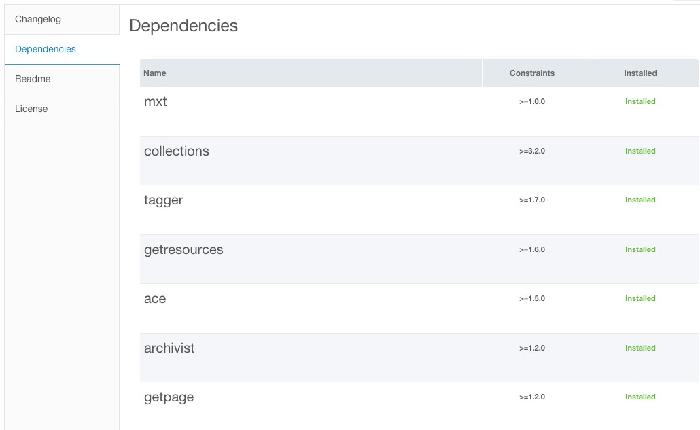
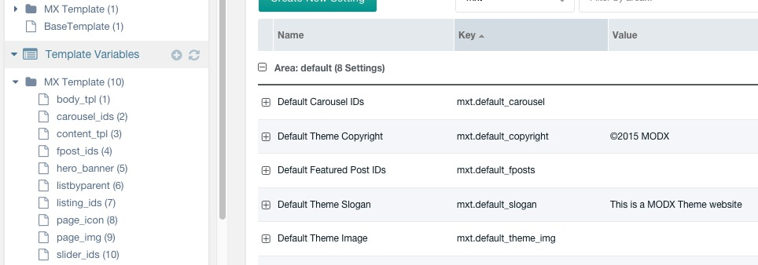
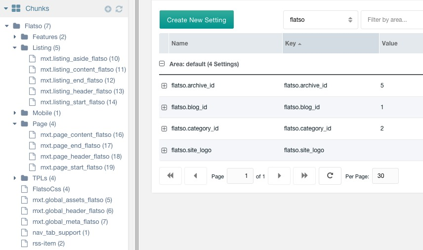
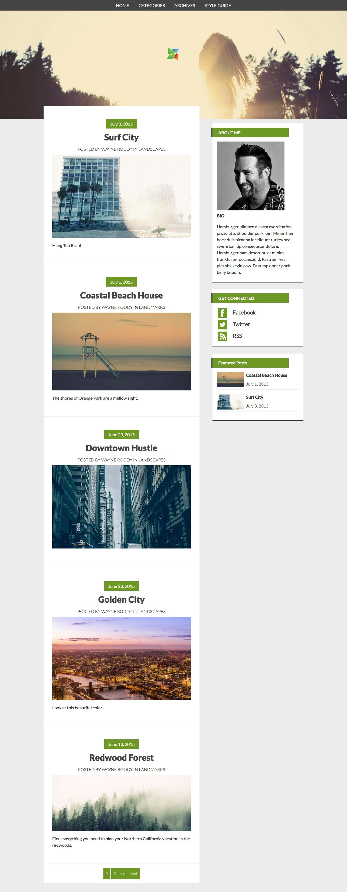

# flatso
Home of Flatso: the simple personal blog theme for MODX, done without any "Parent Extras" like "Articles", but instead using MODX 2.4 dependencies to install Extras.

This package has 1 goal:

**Get you up and running with a standard MODX Blog install with the least barrier to entry.**

##Framework

Build on the [MODX Themes](https://github.com/modxcms/themes/wiki) Framework

The Wiki in this Repo should however contain all of the information you need about the **Theme Markup**.

##Requirements

1. MODX 2.4 - For the dependencies

2. MODX Theme Extra (Package) - For the base config

3. Flatso Extra (Package) - For everything else!

---

